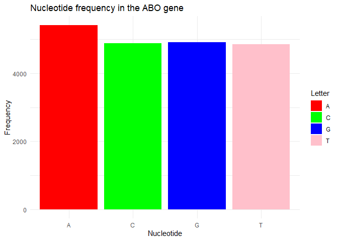
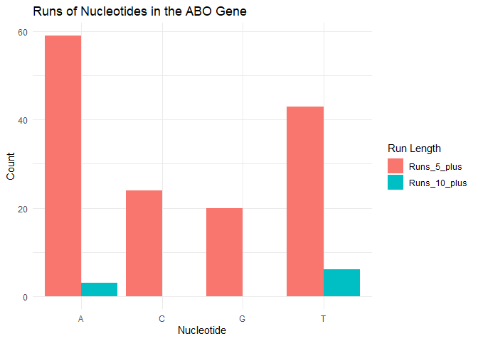

ABO-gene-analysis
================
Arthur Raymond
2024-02-16

- [The human genome v19](#the-human-genome-v19)
  - [Pulling the genome:](#pulling-the-genome)
  - [Saving the sequence as a local
    file:](#saving-the-sequence-as-a-local-file)
- [Analysis of the ABO gene](#analysis-of-the-abo-gene)
  - [G+C content](#gc-content)
  - [Nucleotide Frequency](#nucleotide-frequency)
  - [Runs of Nucleotides](#runs-of-nucleotides)

``` r
## Libraries

#tidyverse for plotting and vis
library(tidyverse)

#janitor for cont tables
library(janitor)

#reshape2 for melting data
library(reshape2)

#base BSgenome
library(BSgenome)

#genome for Homo sapiens
library(BSgenome.Hsapiens.UCSC.hg19)
```

# The human genome v19

Pulling the Human Genome v19 (hg19) and saving it locally as a local
file (.rds), raw html character string, and raw html character string
with line breaks

## Pulling the genome:

``` r
## Pulling the genome

#UCSC genome browser: 
# https://genome.ucsc.edu/cgi-bin/hgTracks?db=hg19&lastVirtModeType=default&lastVirtModeExtraState=&virtModeType=default&virtMode=0&nonVirtPosition=&position=chr9%3A135900001%2D137400000&hgsid=1934901872_BEYKSWSyGA7yhW5PLZ8M51UvFa9c


#set var for human genome v19
genome <- getBSgenome(BSgenome.Hsapiens.UCSC.hg19)

#to view list of sequences:
genome
```

    ## | BSgenome object for Human
    ## | - organism: Homo sapiens
    ## | - provider: UCSC
    ## | - genome: hg19
    ## | - release date: June 2013
    ## | - 298 sequence(s):
    ## |     chr1                  chr2                  chr3                 
    ## |     chr4                  chr5                  chr6                 
    ## |     chr7                  chr8                  chr9                 
    ## |     chr10                 chr11                 chr12                
    ## |     chr13                 chr14                 chr15                
    ## |     ...                   ...                   ...                  
    ## |     chr19_gl949749_alt    chr19_gl949750_alt    chr19_gl949751_alt   
    ## |     chr19_gl949752_alt    chr19_gl949753_alt    chr20_gl383577_alt   
    ## |     chr21_gl383578_alt    chr21_gl383579_alt    chr21_gl383580_alt   
    ## |     chr21_gl383581_alt    chr22_gl383582_alt    chr22_gl383583_alt   
    ## |     chr22_kb663609_alt                                               
    ## | 
    ## | Tips: call 'seqnames()' on the object to get all the sequence names, call
    ## | 'seqinfo()' to get the full sequence info, use the '$' or '[[' operator to
    ## | access a given sequence, see '?BSgenome' for more information.

``` r
#isolate chromosome 9
seqchr9 <- getSeq(genome, "chr9")

#isolate long arm q region 34 subband 2
seqchr9q34.2 <- getSeq(genome, "chr9", start=135900001, end=137400000)

#isolate ABO gene
seqchr9q34.2ABO <- getSeq(genome, "chr9", start=136130563, end=136150630)

#look at ABO gene as rds file
seqchr9q34.2ABO
```

    ## 20068-letter DNAString object
    ## seq: GTGTCTTTCTGTGTGTGTCTGTGTATGTAATGGTGT...ACCTCGGCCATGGCTCCGCGTCTGGTCTCGGCCTCC

``` r
#ABO gene as characters for analysis 
ABO_char <- getSeq(genome, "chr9", start=136130563, end=136150630, as.character=TRUE)
```

## Saving the sequence as a local file:

``` r
## Save Sequence as html file for easy viewing

#save a char string as html
writeLines(ABO_char, "ABO_gene.html")


##Create function to easier viewing that isn't all a single line
#Function to insert line breaks every n characters
insert_line_breaks <- function(sequence, n) {
  # Split the sequence into chunks of n characters
  chunks <- strsplit(sequence, "")
  chunks <- lapply(chunks, function(x) paste(x, collapse = ""))
  chunks <- lapply(chunks, function(x) gsub(paste0("(.{", n, "})"), "\\1\n", x))
  # Concatenate the chunks with line breaks
  formatted_sequence <- unlist(chunks)
  formatted_sequence <- paste(formatted_sequence, collapse = "")
  return(formatted_sequence)
}

# Format the sequence with line breaks every 50 characters
formatted_sequence <- insert_line_breaks(ABO_char, 50)

# Write the formatted sequence to an HTML file
write_html_sequence <- function(sequence, filename) {
  cat('<!DOCTYPE html>
<html lang="en">
<head>
    <meta charset="UTF-8">
    <meta name="viewport" content="width=device-width, initial-scale=1.0">
    <title>Sequence Display</title>
</head>
<body>
    <div>
        <h1>Sequence</h1>
        <pre id="sequence">', file = filename)
  cat(sequence, file = filename, sep = "", append = TRUE)
  cat('</pre>
    </div>
</body>
</html>', file = filename, sep = "\n", append = TRUE)
}

# Write the formatted sequence to the HTML file
write_html_sequence(formatted_sequence, "ABO_gene_formatted.html")


#save seqchr9q34.2ABO in its native format
saveRDS(seqchr9q34.2ABO, file = "ABO_gene.rds")
```

# Analysis of the ABO gene

## G+C content

``` r
## G+C content

#Get G+C content for the gene
atcg <- alphabetFrequency(seqchr9q34.2ABO)
atcg
```

    ##    A    C    G    T    M    R    W    S    Y    K    V    H    D    B    N    - 
    ## 5412 4883 4923 4850    0    0    0    0    0    0    0    0    0    0    0    0 
    ##    +    . 
    ##    0    0

``` r
#Create the data frame
df <- as.data.frame(atcg)
#insert row names in its own column
df$Letter <- rownames(df)
#remove old row names
rownames(df) <- NULL
#swap cols
df <- df[, c("Letter", "atcg")]
#remove all rows where frequency is 0
df <- df[df$atcg != 0,]
#sanity check that the df is made correctly
df[,2]==atcg[1:4]
```

    ##    A    C    G    T 
    ## TRUE TRUE TRUE TRUE

``` r
df
```

    ##   Letter atcg
    ## 1      A 5412
    ## 2      C 4883
    ## 3      G 4923
    ## 4      T 4850

``` r
#plot the data with ggplot with g being blue, t  pink, c  green and a  red
ggplot(df, aes(x = Letter, y = atcg, fill = Letter)) +
  geom_bar(stat = "identity") +
  scale_fill_manual(values = c("red", "green", "blue", "pink")) +
  labs(
    title = "Nucleotide frequency in the ABO gene",
    x = "Nucleotide",
    y = "Frequency"
  ) +
  theme_minimal()
```

<!-- -->

``` r
##Perform statistical analysis to see if there is a significant difference 
## in the frequency of nucleotides
#perform a chi-squared test
  #H0: there is no significant difference in the frequency of nucleotides 
  #H1: there is a significant difference in the frequency of nucleotides
chisq.test(df$atcg)
```

    ## 
    ##  Chi-squared test for given probabilities
    ## 
    ## data:  df$atcg
    ## X-squared = 41.998, df = 3, p-value = 4.015e-09

``` r
#We reject the null hypothesis and conclude that there is a significant 
# difference in the frequency of nucleotides in the ABO gene
```

## Nucleotide Frequency

``` r
## Longest Consecutive Sequence

# Find the longest consecutive sequence of the same nucleotide
longest_consecutive <- function(sequence) {
  
  # Split the sequence into individual characters
  chars <- unlist(strsplit(sequence, ""))
    
  # Initialize variables to store information about the current consecutive sequence
  current_char <- chars[1]
  current_count <- 1
  max_char <- chars[1]
  max_count <- 1
  
  # Loop through each character in the sequence
  for (i in 2:length(chars)) {
    if (chars[i] == current_char) {
      # Increment count if the current character matches the previous one
      current_count <- current_count + 1
    } else {
      # Update max_count and max_char if the current consecutive sequence is longer
      if (current_count > max_count) {
        max_count <- current_count
        max_char <- current_char
      }
      # Reset current_count and current_char for the new consecutive sequence
      current_count <- 1
      current_char <- chars[i]
    }
  }
  
  # Check if the last consecutive sequence is the longest
  if (current_count > max_count) {
    max_count <- current_count
    max_char <- current_char
  }
  
  # Return the longest consecutive sequence and its length
  return(list(character = max_char, length = max_count))
}

result <- longest_consecutive(ABO_char)

cat("Longest consecutive sequence:", result$length, "characters of", result$character, "\n")
```

    ## Longest consecutive sequence: 19 characters of A

## Runs of Nucleotides

``` r
## Runs of Nucleotides

# Find all consecutive sequences of A, C, T, or G
consecutive_sequences <- gregexpr("(A+|C+|T+|G+)", ABO_char, perl = TRUE)

# Extract the consecutive sequences

sequences <- regmatches(ABO_char, consecutive_sequences)[[1]]
# Function to count runs of 5+ and 10+

count_runs <- function(seq, length_threshold) {
  runs <- nchar(seq)
  runs_5_plus <- sum(runs >= length_threshold)
  runs_10_plus <- sum(runs >= length_threshold * 2)
  return(c(runs_5_plus, runs_10_plus))
}

# Initialize a data frame to store the counts
counts_df <- data.frame(Character = c("A", "C", "G", "T"),
                        Runs_5_plus = numeric(4),
                        Runs_10_plus = numeric(4))

# Iterate over each character and count runs of 5+ and 10+
for (i in 1:4) {
  char <- counts_df$Character[i]
  char_sequences <- sequences[grep(char, sequences)]
  counts <- count_runs(char_sequences, 5)
  counts_df$Runs_5_plus[i] <- counts[1]
  counts_df$Runs_10_plus[i] <- counts[2]
}

# Print the data frame
print(counts_df)
```

    ##   Character Runs_5_plus Runs_10_plus
    ## 1         A          59            3
    ## 2         C          24            0
    ## 3         G          20            0
    ## 4         T          43            6

``` r
# Plot the counts
counts_df_long <- melt(counts_df, id.vars = "Character")

ggplot(counts_df_long, aes(x = Character, y = value, fill = variable)) +
  geom_bar(stat = "identity", position = "dodge") +
  labs(
    title = "Runs of Nucleotides in the ABO Gene",
    x = "Nucleotide",
    y = "Count",
    fill = "Run Length"
  ) +
  theme_minimal()
```

<!-- -->

``` r
# Perform statistical analysis to see if there is a significant difference 
# in the number of runs of nucleotides

# Perform a chi-squared test
# H0: there is no significant difference in the number of runs of nucleotides in the ABO gene
# H1: there is a significant difference in the number of runs of nucleotides in the ABO gene
chisq.test(counts_df$Runs_5_plus)
```

    ## 
    ##  Chi-squared test for given probabilities
    ## 
    ## data:  counts_df$Runs_5_plus
    ## X-squared = 26.767, df = 3, p-value = 6.588e-06

``` r
# We reject the null hypothesis and conclude that there is a significant difference 
# in the number of runs of nucleotides in the ABO gene
```
